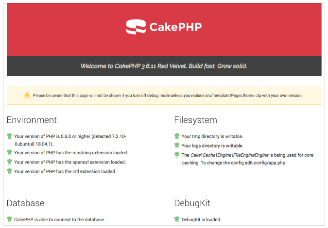

# CakePHP 3.6 Docker Image Container

A [CakePHP Docker Container][docker] which installs a fresh, fully configured
and operational version of CakePHP 3.6. It comes with two pre-configured
databases, for both production and testing environments and the app runs on PHP
7.2, Apache 2.4 and MySQL 5.7.

<!-- TOC START min:2 max:6 link:true update:true -->
- [Installation](#installation)
- [Supported Tags and respective `Dockerfile` links](#supported-tags-and-respective-dockerfile-links)
    - [`apache-php-7.2`, `apache-7.2` and `latest`](#apache-php-72-apache-72-and-latest)
    - [`apache-php-7.0` and `apache-7.0`](#apache-php-70-and-apache-70)
    - [`nginx-php-7.2` and `nginx-7.2`](#nginx-php-72-and-nginx-72)
- [Modifying CakePHP Settings](#modifying-cakephp-settings)
- [Accessing the Databases](#accessing-the-databases)
    - [Production Database](#production-database)
    - [Testing Database](#testing-database)
    - [Changing User Passwords](#changing-user-passwords)
- [What is CakePHP?](#what-is-cakephp)
- [Quick reference](#quick-reference)

<!-- TOC END -->


## Installation

Installation is dead-easy. Just run the following command and then visit
your browser (e.g. http://192.168.99.1) to see your newly configured CakePHP
website.

```docker
docker run -p 80:80 justinhartman/cakephp3.5-php7-mysql-apache2:latest
```

## Supported Tags and respective `Dockerfile` links

### `apache-php-7.2`, `apache-7.2` and `latest`

[`apache-php-7.2`, `apache-7.2`, `latest` (php/apache/7.2/Dockerfile)][apache-7.2]

The tags above install the following software versions:

1. CakePHP 3.6.11
1. PHP 7.2.10
1. Apache 2.4.29
1. MySQL 5.7.23

### `apache-php-7.0` and `apache-7.0`

[`apache-php-7.0`, `apache-7.0` (php/apache/7.0/Dockerfile)][apache-7.0]

The tags above install the following software versions:

1. CakePHP 3.6.11
1. PHP 7.0.32
1. Apache 2.4.18
1. MySQL 5.7.23

### `nginx-php-7.2` and `nginx-7.2`

[`nginx-php-7.2`, `nginx-7.2`, `latest` (php/nginx/7.2/Dockerfile)][nginx-7.2]

The tags above install the following software versions:

1. CakePHP 3.6.11
1. PHP-FPM 7.2.10
1. Nginx 1.14.0
1. MySQL 5.7.23

## Modifying CakePHP Settings

There is [dotenv support][dotenv] which has been made available in your
`/config/bootstrap.php` file. You can access and modify any settings you'd like
to make by editing `/config/.env`. Do not make changes to either
`/config/app.php` or `/config/app.default.php` as it is better to work off the
`.env` file for any configuration changes.

The `.env` file has configuration options for:

- General app settings
- Cache control
- Email transport
- Database connection
- Logging options
- Session and Error level configuration

## Accessing the Databases

The container comes with MySQL pre-installed and during the Docker creation, two
databases are installed for both production and any unit tests you need to run.

These are:

### Production Database

Database: `cakephp_live`  
Username: `cakephp_live_user`  
Password: `b5uF95fstJmhABD4is`  
Connection: `DATABASE_URL` exists in your `/config/.env` file with the full
connection string to the production database.

### Testing Database

Database: `cakephp_test`  
Username: `cakephp_test_user`  
Password: `4hiEKuzgFr54fyPVQJ`  
Connection: `DATABASE_TEST_URL` exists in your `/config/.env` file with the full
connection string to the testing database.

### Changing User Passwords

If you'd like to change the password for the two default MySQL user accounts
then run the following commands in MySQL - replace `$PASSWORD` with your new
password for the account.

```mysql
mysql> FLUSH PRIVILEGES;
mysql> ALTER USER 'cakephp_live_user'@'localhost' IDENTIFIED BY '$PASSWORD';
mysql> ALTER USER 'cakephp_test_user'@'localhost' IDENTIFIED BY '$PASSWORD';
```

**IMPORTANT:** The MySQL root password has not been set in the Docker container.
Please make sure to change this and set a password for your `root` MySQL
account as it is not secure if left as is. You can follow the same method above
to set a `root` password or you could run `$ mysql_secure_installation` in a
terminal window in the Container Image which would completely secure your
MySQL installation.

## What is CakePHP?

[CakePHP][cakephp] is an open source web application framework. It follows the
Model-View-Controller (MVC) approach and is written in PHP, modelled after the
concepts of Ruby on Rails, and distributed under the MIT License.

## Quick reference

- **Where to file issues**:  
  [@justinhartman/docker-cakephp3.6-php7-mysql-apache2/issues][issues]
- **Maintained by**:  
  [Justin Hartman][justinhartman]
- **Supported Docker versions**:  
  [the latest release][releases] (down to 1.6 on a best-effort basis)

[cakephp]: http://cakephp.org
[docker]: https://hub.docker.com/r/justinhartman/cakephp3.5-php7-mysql-apache2/
[dotenv]: https://github.com/josegonzalez/php-dotenv
[justinhartman]: https://github.com/justinhartman
[issues]: https://github.com/justinhartman/docker-cakephp3.6-php7-mysql-apache2/issues
[releases]: https://github.com/docker/docker-ce/releases/latest
[apache-7.2]: https://github.com/justinhartman/docker-cakephp3.5-php7-mysql-apache2/blob/c9a60c3c9ad1a4b1b7bc596fe3ac6dcc99e73d47/php/apache/7.2/Dockerfile
[apache-7.0]: https://github.com/justinhartman/docker-cakephp3.5-php7-mysql-apache2/blob/60946cf5f78f5956f43545f65f5737119e8d202c/php/apache/7.0/Dockerfile
[nginx-7.2]:https://github.com/justinhartman/docker-cakephp3.5-php7-mysql-apache2/blob/0d9e1f21dbd21c60191ed293252a156d50bc2391/php/nginx/7.2/Dockerfile
